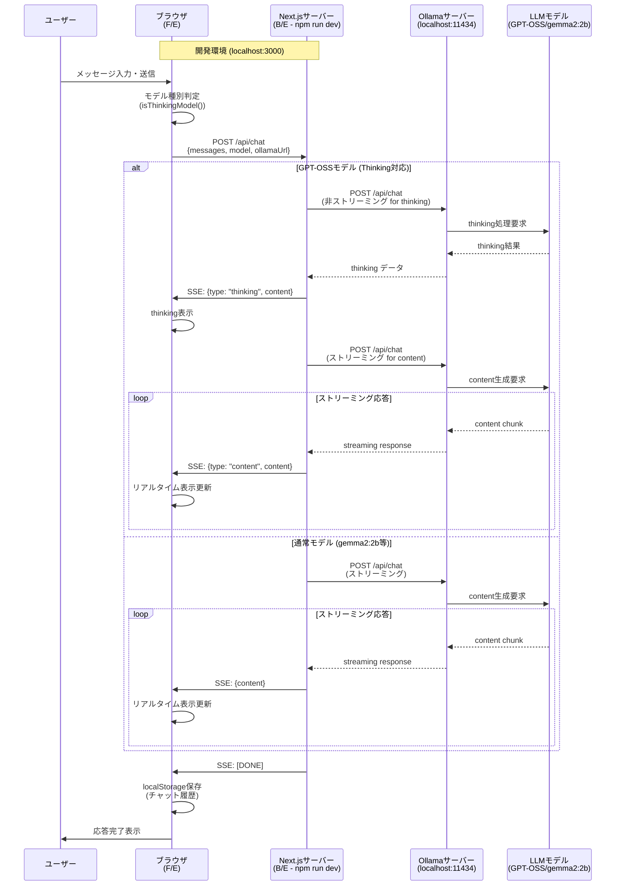
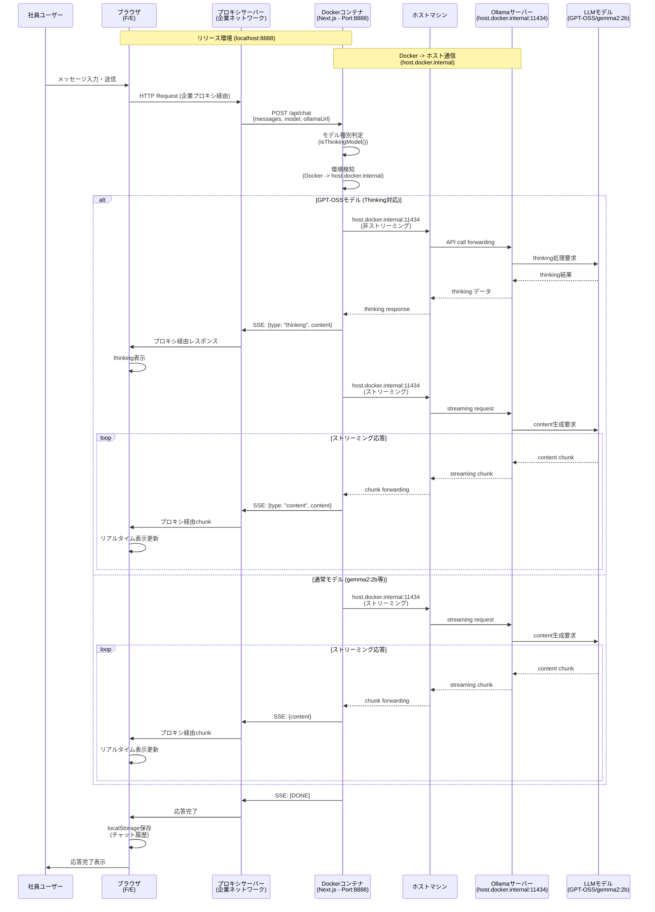
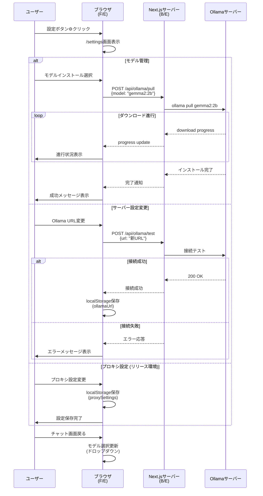
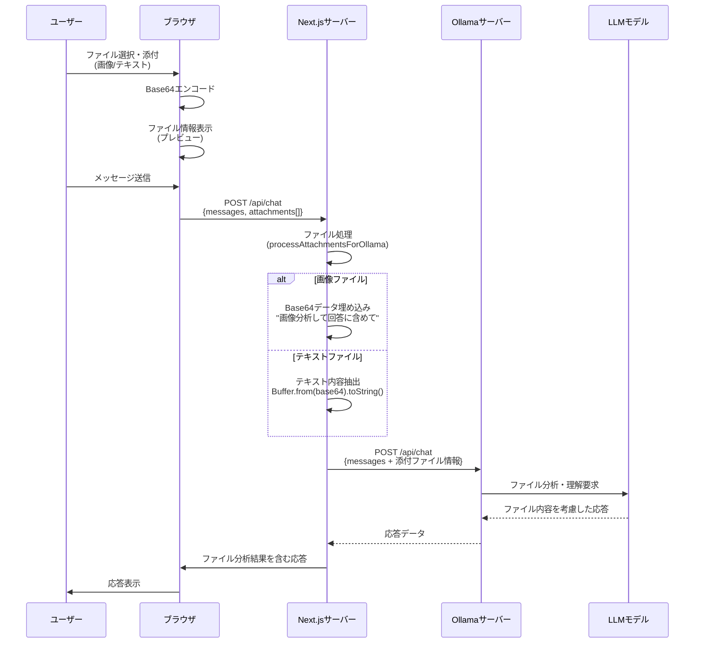
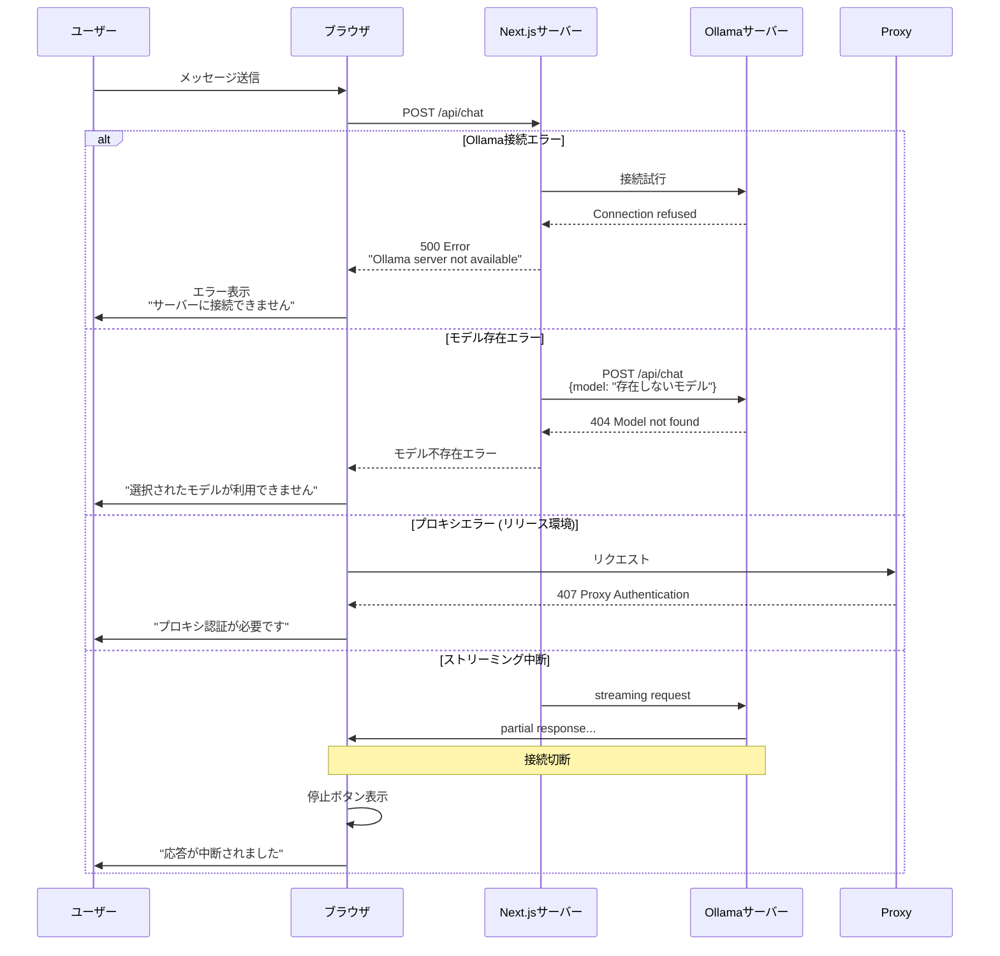

# アプリケーション シーケンス図

## 開発環境でのメッセージ処理フロー

```mermaid
sequenceDiagram
    participant User as ユーザー
    participant Browser as ブラウザ<br/>(F/E)
    participant NextJS as Next.jsサーバー<br/>(B/E - npm run dev)
    participant Ollama as Ollamaサーバー<br/>(localhost:11434)
    participant LLM as LLMモデル<br/>(GPT-OSS/gemma2:2b)

    Note over Browser, NextJS: 開発環境 (localhost:3000)
    
    User->>Browser: メッセージ入力・送信
    Browser->>Browser: モデル種別判定<br/>(isThinkingModel())
    Browser->>NextJS: POST /api/chat<br/>{messages, model, ollamaUrl}
    
    alt GPT-OSSモデル (Thinking対応)
        NextJS->>Ollama: POST /api/chat<br/>(非ストリーミング for thinking)
        Ollama->>LLM: thinking処理要求
        LLM-->>Ollama: thinking結果
        Ollama-->>NextJS: thinking データ
        NextJS->>Browser: SSE: {type: "thinking", content}
        Browser->>Browser: thinking表示
        
        NextJS->>Ollama: POST /api/chat<br/>(ストリーミング for content)
        Ollama->>LLM: content生成要求
        loop ストリーミング応答
            LLM-->>Ollama: content chunk
            Ollama-->>NextJS: streaming response
            NextJS->>Browser: SSE: {type: "content", content}
            Browser->>Browser: リアルタイム表示更新
        end
    else 通常モデル (gemma2:2b等)
        NextJS->>Ollama: POST /api/chat<br/>(ストリーミング)
        Ollama->>LLM: content生成要求
        loop ストリーミング応答
            LLM-->>Ollama: content chunk
            Ollama-->>NextJS: streaming response
            NextJS->>Browser: SSE: {content}
            Browser->>Browser: リアルタイム表示更新
        end
    end
    
    NextJS->>Browser: SSE: [DONE]
    Browser->>Browser: localStorage保存<br/>(チャット履歴)
    Browser->>User: 応答完了表示
```

## リリース環境でのメッセージ処理フロー

```mermaid
sequenceDiagram
    participant User as 社員ユーザー
    participant Browser as ブラウザ<br/>(F/E)
    participant Proxy as プロキシサーバー<br/>(企業ネットワーク)
    participant Docker as Dockerコンテナ<br/>(Next.js - Port:8888)
    participant Host as ホストマシン
    participant Ollama as Ollamaサーバー<br/>(host.docker.internal:11434)
    participant LLM as LLMモデル<br/>(GPT-OSS/gemma2:2b)

    Note over Browser, Docker: リリース環境 (localhost:8888)
    Note over Docker, Ollama: Docker -> ホスト通信<br/>(host.docker.internal)
    
    User->>Browser: メッセージ入力・送信
    Browser->>Proxy: HTTP Request (企業プロキシ経由)
    Proxy->>Docker: POST /api/chat<br/>{messages, model, ollamaUrl}
    Docker->>Docker: モデル種別判定<br/>(isThinkingModel())
    Docker->>Docker: 環境検知<br/>(Docker -> host.docker.internal)
    
    alt GPT-OSSモデル (Thinking対応)
        Docker->>Host: host.docker.internal:11434<br/>(非ストリーミング)
        Host->>Ollama: API call forwarding
        Ollama->>LLM: thinking処理要求
        LLM-->>Ollama: thinking結果
        Ollama-->>Host: thinking データ
        Host-->>Docker: thinking response
        Docker->>Proxy: SSE: {type: "thinking", content}
        Proxy->>Browser: プロキシ経由レスポンス
        Browser->>Browser: thinking表示
        
        Docker->>Host: host.docker.internal:11434<br/>(ストリーミング)
        Host->>Ollama: streaming request
        Ollama->>LLM: content生成要求
        loop ストリーミング応答
            LLM-->>Ollama: content chunk
            Ollama-->>Host: streaming chunk
            Host-->>Docker: chunk forwarding
            Docker->>Proxy: SSE: {type: "content", content}
            Proxy->>Browser: プロキシ経由chunk
            Browser->>Browser: リアルタイム表示更新
        end
    else 通常モデル (gemma2:2b等)
        Docker->>Host: host.docker.internal:11434<br/>(ストリーミング)
        Host->>Ollama: streaming request
        Ollama->>LLM: content生成要求
        loop ストリーミング応答
            LLM-->>Ollama: content chunk
            Ollama-->>Host: streaming chunk
            Host-->>Docker: chunk forwarding
            Docker->>Proxy: SSE: {content}
            Proxy->>Browser: プロキシ経由chunk
            Browser->>Browser: リアルタイム表示更新
        end
    end
    
    Docker->>Proxy: SSE: [DONE]
    Proxy->>Browser: 応答完了
    Browser->>Browser: localStorage保存<br/>(チャット履歴)
    Browser->>User: 応答完了表示
```

## モデル管理・設定変更フロー

```mermaid
sequenceDiagram
    participant User as ユーザー
    participant Browser as ブラウザ<br/>(F/E)
    participant NextJS as Next.jsサーバー<br/>(B/E)
    participant Ollama as Ollamaサーバー

    User->>Browser: 設定ボタン⚙️クリック
    Browser->>Browser: /settings画面表示
    
    alt モデル管理
        User->>Browser: モデルインストール選択
        Browser->>NextJS: POST /api/ollama/pull<br/>{model: "gemma2:2b"}
        NextJS->>Ollama: ollama pull gemma2:2b
        loop ダウンロード進行
            Ollama-->>NextJS: download progress
            NextJS-->>Browser: progress update
            Browser->>User: 進行状況表示
        end
        Ollama-->>NextJS: インストール完了
        NextJS-->>Browser: 完了通知
        Browser->>User: 成功メッセージ表示
    else サーバー設定変更
        User->>Browser: Ollama URL変更
        Browser->>NextJS: POST /api/ollama/test<br/>{url: "新URL"}
        NextJS->>Ollama: 接続テスト
        alt 接続成功
            Ollama-->>NextJS: 200 OK
            NextJS-->>Browser: 接続成功
            Browser->>Browser: localStorage保存<br/>(ollamaUrl)
        else 接続失敗
            NextJS-->>Browser: エラー応答
            Browser->>User: エラーメッセージ表示
        end
    else プロキシ設定 (リリース環境)
        User->>Browser: プロキシ設定変更
        Browser->>Browser: localStorage保存<br/>(proxySettings)
        Browser->>User: 設定保存完了
    end
    
    User->>Browser: チャット画面戻る
    Browser->>Browser: モデル選択更新<br/>(ドロップダウン)
```

## ファイル添付機能フロー

```mermaid
sequenceDiagram
    participant User as ユーザー
    participant Browser as ブラウザ
    participant NextJS as Next.jsサーバー
    participant Ollama as Ollamaサーバー
    participant LLM as LLMモデル

    User->>Browser: ファイル選択・添付<br/>(画像/テキスト)
    Browser->>Browser: Base64エンコード
    Browser->>Browser: ファイル情報表示<br/>(プレビュー)
    
    User->>Browser: メッセージ送信
    Browser->>NextJS: POST /api/chat<br/>{messages, attachments[]}
    NextJS->>NextJS: ファイル処理<br/>(processAttachmentsForOllama)
    
    alt 画像ファイル
        NextJS->>NextJS: Base64データ埋め込み<br/>"画像分析して回答に含めて"
    else テキストファイル
        NextJS->>NextJS: テキスト内容抽出<br/>Buffer.from(base64).toString()
    end
    
    NextJS->>Ollama: POST /api/chat<br/>{messages + 添付ファイル情報}
    Ollama->>LLM: ファイル分析・理解要求
    LLM-->>Ollama: ファイル内容を考慮した応答
    Ollama-->>NextJS: 応答データ
    NextJS->>Browser: ファイル分析結果を含む応答
    Browser->>User: 応答表示
```

## エラー処理・フォールバック フロー

```mermaid
sequenceDiagram
    participant User as ユーザー
    participant Browser as ブラウザ
    participant NextJS as Next.jsサーバー
    participant Ollama as Ollamaサーバー

    User->>Browser: メッセージ送信
    Browser->>NextJS: POST /api/chat
    
    alt Ollama接続エラー
        NextJS->>Ollama: 接続試行
        Ollama-->>NextJS: Connection refused
        NextJS-->>Browser: 500 Error<br/>"Ollama server not available"
        Browser->>User: エラー表示<br/>"サーバーに接続できません"
    else モデル存在エラー  
        NextJS->>Ollama: POST /api/chat<br/>{model: "存在しないモデル"}
        Ollama-->>NextJS: 404 Model not found
        NextJS-->>Browser: モデル不存在エラー
        Browser->>User: "選択されたモデルが利用できません"
    else プロキシエラー (リリース環境)
        Browser->>Proxy: リクエスト
        Proxy-->>Browser: 407 Proxy Authentication
        Browser->>User: "プロキシ認証が必要です"
    else ストリーミング中断
        NextJS->>Ollama: streaming request
        Ollama->>Browser: partial response...
        Note over Ollama, Browser: 接続切断
        Browser->>Browser: 停止ボタン表示
        Browser->>User: "応答が中断されました"
    end
```